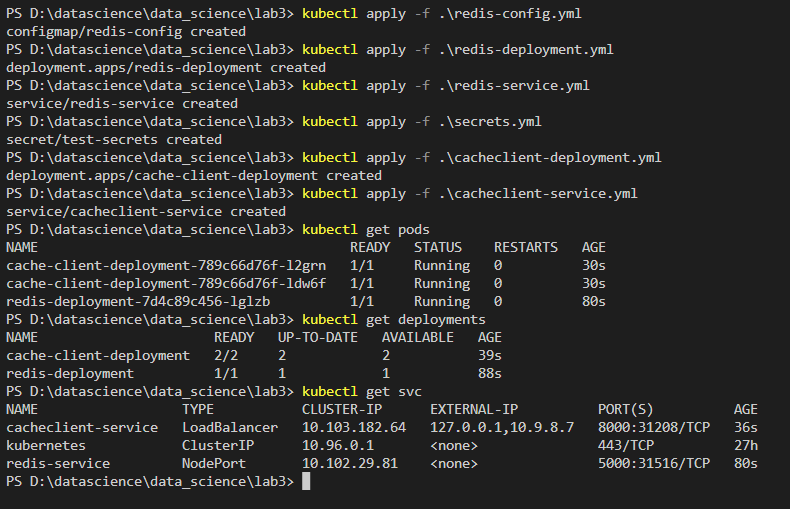
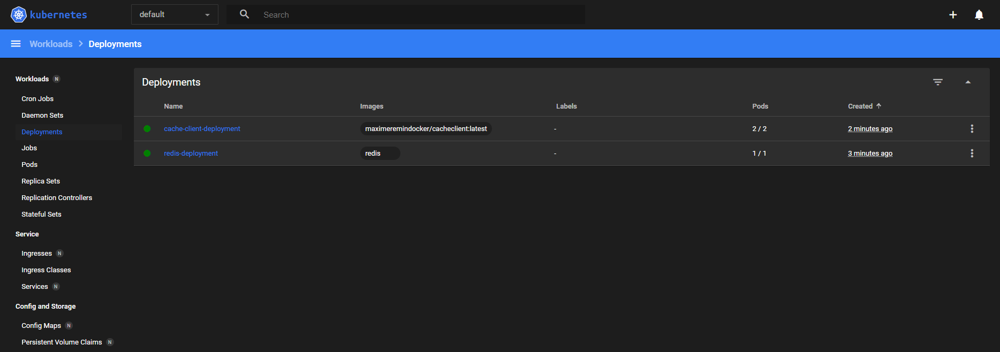
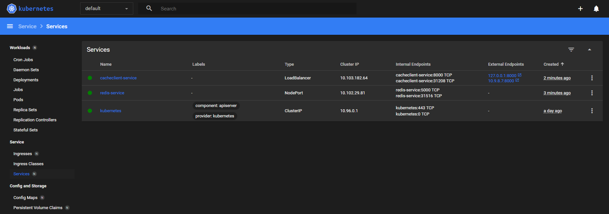
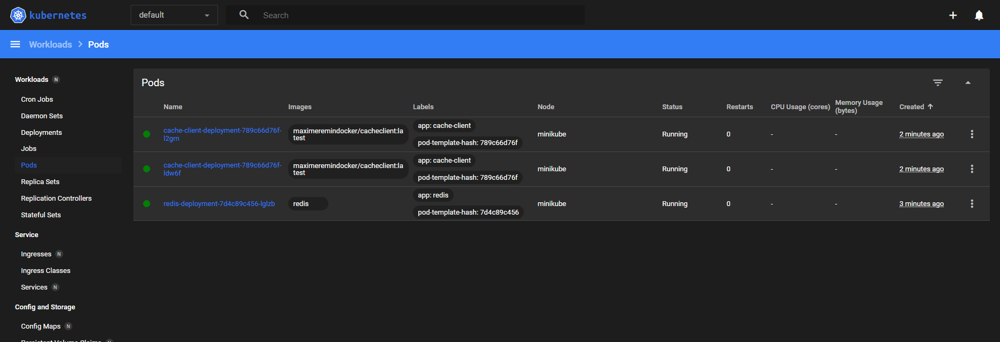
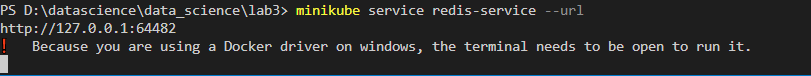
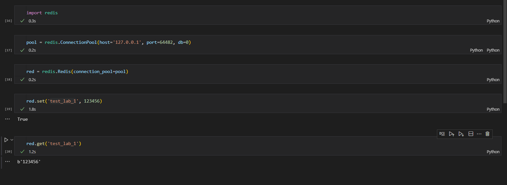

# ЛР 3
> Валов Вадим М80-108Б-22

### Деплой всех ресурсов

>Используем `kubectl apply`, видим все все создалось (`kubectl get`), 

#

>Далее проверяем дашборд

#

### Получаем доступ к ресурсам

> Изменил тип `redis-service` на NodePort 

Получаем url сервиса

>Далее с помощью `python` работаем с redis и проверяем, что все работает верно

