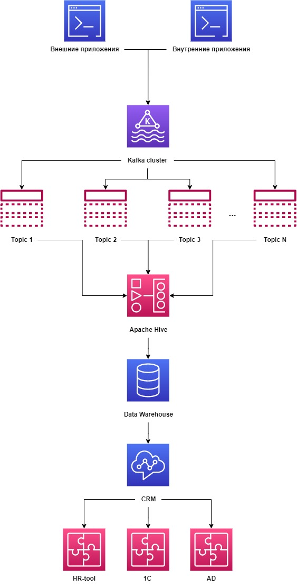
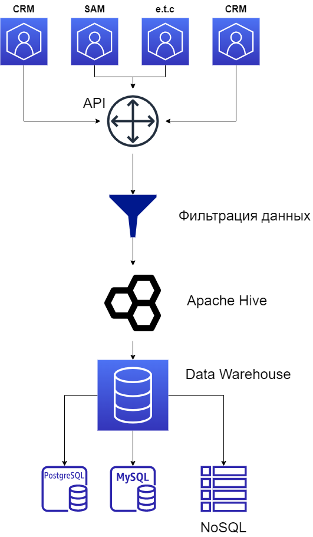

# Лабораторная работа 4
> Валов Вадим М80-108М-22

### Кейс 1

Данные о новых сотруднках можно получать из внутренних приложений, либо из внешних, используя API.

Далее нужно передать данные используя брокер сообщений (Kafka). После получения данных, их необходимо отфильтровать и очистить от возможных ошибок.

Затем, используя HIVE происходит унифицирование данных и их структуры, потом данные отправляются в долгосрочное хранилище, а из него могут загружиться уже в дргие базы, или например CRM и т.д. 

### Кейс 2

Данные о транзакциях получаем из систем CRM, SAM и других. 
Далее с попощью какого-либо API (rest, kafka и т.д.) передаем транзакции для очистки от неправильных данных.

Далее происходит унифицирование данных и их структуры, передача их в хранилище данных, из которого уже в свою очередь происходит передача данных в другие базы, либо же хранение всех данных сразу в системе HIVE.