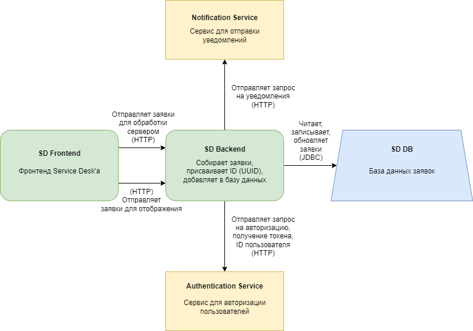
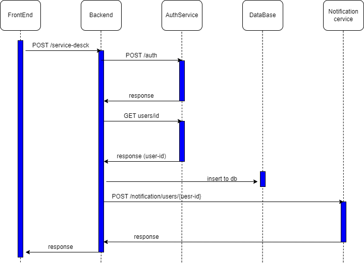
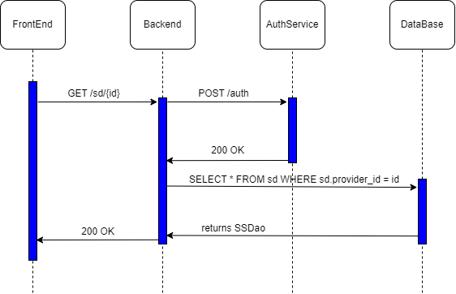
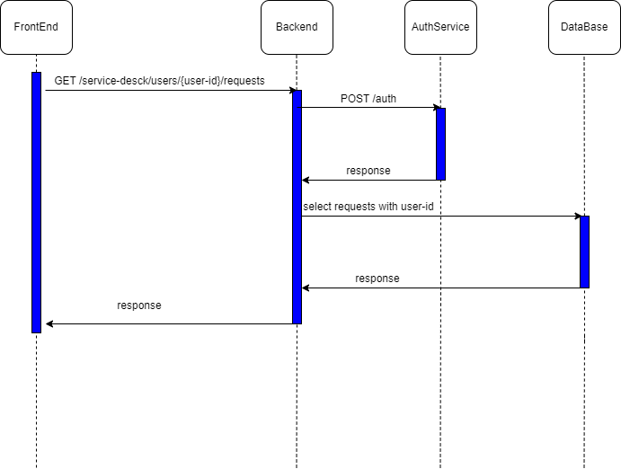
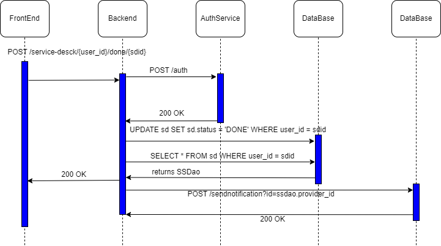

# Лабораторная работа 5

> Валов Вадим М8О-108М-22

## Описание

Service Desk - совокупность взаимосвязанных сервисов, предоставляющие функциональность хранения, отображения, обновления заявок.

- SD Frontend - браузерное окно с интерфейсом
- SD Backend - серверная часть приложения Service Desk
- SD DB - база данных приложения Service Desk
- Notification Service - сервис нотификаций приложения Service Desk

Спецификация требований:

(тут должен быть набор из пунктов согласно гост (введение, назначение, границы проекта, ссылки, общее описание ...))

Общие требование Service Desk:
1) Поддержка универсального сценария обработки заявок.
2) Автоматизация создания заявок.
3) Автоматизация инфраструктурных запросов.
4) Хранение общей базы по существующим тикетам.

Окружение:
- PostgreSQL 14
- JavaScript 9
- Kubernetes 1.26
- Gitlab 15.6.1
- Docker Engine 19.03

## HLD

## Создание заявки

Метод: **POST**

Эндпоинт: `/service-desck`

Тело:
- `id` - id пользователя
- `ticket_name` - тема заявки
- `urgency` - срочность заявки
- `text` - текст заявки

Результат запроса: появление записи в БД с уникальным id и параметрами запроса.

С помощью метода `users/id` можно найти исполнителя заявки и отправить ему уведомление с помощью метода `/notification/users/{user-id}`.

## Получение своих заявок

Метод: **GET**

Эндпоинт: `/sd/id`

Параметры:
- `id` - id пользователя

Результат запроса: json c массивом: `[id, ticket_name, urgency, text]`

## Получение заявок на выполнение

Метод: **GET**

Эндпоинт: `/service-desck/users/{user-id}/requests`

Параметры:
- `user_id` - id пользователя

Результат запроса: json c массивом: `[id, ticket_name, urgency, text]`

## Обновление статуса выполненной заявки

Метод: **POST**

Тело:
- `user_id` - id пользователя
- `sdid` - id заявки

Результат запроса: обновление статуса заявки в БД, отправка уведомления.